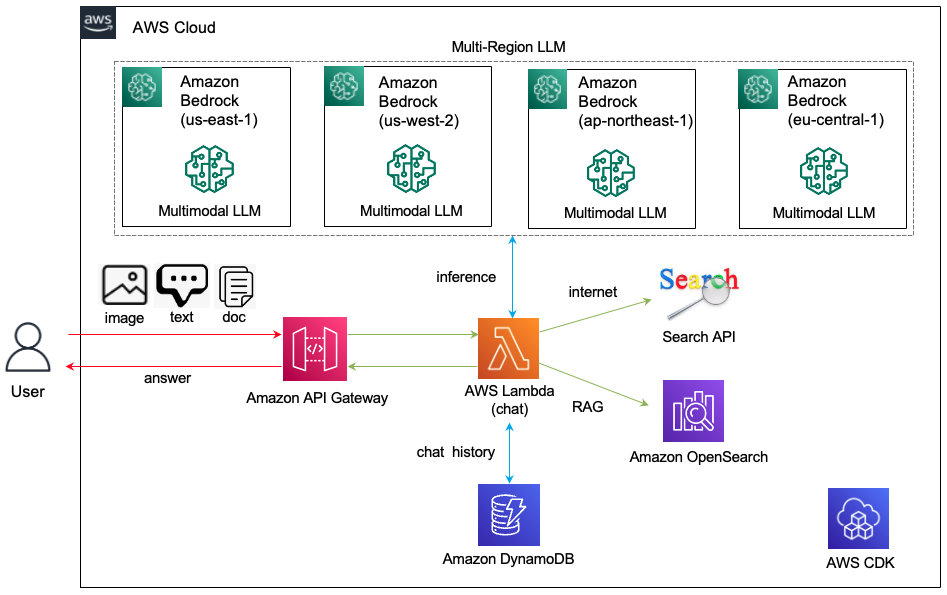

# LangChain으로 Multimodal과 RAG 활용하기

LLM (Large Language Models)을 이용한 어플리케이션을 개발할 때에 [LangChain](https://www.langchain.com/)을 이용하면 쉽고 빠르게 개발할 수 있습니다. 여기에서는 LangChain으로 Multimodal을 활용하고 RAG를 구현할 뿐아니라, Prompt engineering을 활용하여, 번역하기, 문법 오류고치기, 코드 요약하기를 구현합니다. Multimodel을 지원하는 [Anthropic Claude3](https://aws.amazon.com/ko/blogs/machine-learning/unlocking-innovation-aws-and-anthropic-push-the-boundaries-of-generative-ai-together/)는 이전 모델에서 사용하던 [LangChain Bedrock](https://python.langchain.com/docs/integrations/llms/bedrock)을 사용할 수 없고, [LangChain BedrockChat](https://python.langchain.com/docs/integrations/chat/bedrock)을 이용하여야 합니다. BedrockChat은 LangChain의 [chat model component](https://python.langchain.com/docs/integrations/chat/)을 지원하며, Anthropic의 Claude 모델뿐 아니라 AI21 Labs, Cohere, Meta, Stability AI, Amazon Titan을 모두 지원합니다. 

## Architecture 개요

서버리스 Architecture를 이용하여 RAG가 적용된 Chatbot 인프라를 구성하면, 트래픽의 변화에 유연하게 대응할 수 있으며, 유지보수에 대한 부담도 줄일 수 있습니다. 주요 구현 사항은 아래와 같습니다.

- Multimodal: Text뿐 아니라 이미지를 분석할 수 있습니다. 
- Multi-Region LLM: [분당 Request와 토큰 수](https://docs.aws.amazon.com/bedrock/latest/userguide/quotas.html)의 제한을 완화하기 위하여 여러 Region의 LLM을 활용합니다.
- RAG 구성: OpenSearch의 Vector 검색을 이용하여 빠르고 성능이 우수한 RAG를 구성할 수 있습니다.
- 인터넷 검색: RAG에 관련된 문서가 없을 경우에 Google으 Search API를 활용하여 검색된 결과를 활용합니다.
- Prority Search: RAG의 Retrieve를 이용하여 k개의 문서를 얻었지만 일부는 관련도가 낮을수 있어 정확도에 나쁜 영향을 줄 수 있습니다. Faiss의 Similarity Search로 관련된 문서(Relevant Documents)를 관련도에 따라 정렬하고 관련이 없는 문서는 제외할 수 있습니다.
- 채팅 이력의 저장 및 활용: 서버리스 서비스인 Lambda가 실행될 때에 DynamoDB에 저장된 채팅 이력을 가져와 활용합니다.
- 지속적인 대화: API Gateway를 이용하여 WebSocket을 구성하므로써 양방향 대화를 구현할 수 있습니다.
- 편리한 배포: AWS CDK로 관련된 인프라를 배포하고 편리하게 관리할 수 있습니다. 



## 주요 시스템 구성

### LangChain의 BedrockChat

Claude3부터는 BedrockChat을 이용하여야 합니다. 이때, [LangChain Bedrock](https://python.langchain.com/docs/integrations/llms/bedrock)의 max_tokens_to_sample이 BedrockChat에서는 max_tokens로 변경되었습니다. 상세한 코드는 [lambda-chat-ws](./lambda-chat-ws/lambda_function.py)을 참조합니다. 

```python
import boto3
from langchain_community.chat_models import BedrockChat

boto3_bedrock = boto3.client(
    service_name = 'bedrock-runtime',
    region_name = bedrock_region,
    config = Config(
        retries = {
            'max_attempts': 30
        }
    )
)

HUMAN_PROMPT = "\n\nHuman:"
parameters = {
    "max_tokens": maxOutputTokens,
    "temperature": 0.1,
    "top_k": 250,
    "top_p": 0.9,
    "stop_sequences": [HUMAN_PROMPT]
}

chat = BedrockChat(
    model_id = modelId,
    client = boto3_bedrock,
    streaming = True,
    callbacks = [StreamingStdOutCallbackHandler()],
    model_kwargs = parameters,
)
```

### Multimodal 활용

Claude3은 Multimodal을 지원하므로 이미지에 대한 분석을 할 수 있습니다. LangChain의 BedrockChat을 이용하여 Multimodel을 활용합니다. 이후 아래와 같이 Base64로 된 이미지를 이용해 query를 수행하면 이미지에 대한 설명을 얻을 수 있습니다. Sonnet에서 처리할 수 있는 이미지의 크기 제한으로 resize를 수행하여야 합니다. 

```python
if file_type == 'png' or file_type == 'jpeg' or file_type == 'jpg':
    s3_client = boto3.client('s3') 
                    
    image_obj = s3_client.get_object(Bucket=s3_bucket, Key=s3_prefix+'/'+object)
    image_content = image_obj['Body'].read()
    img = Image.open(BytesIO(image_content))
                
    width, height = img.size 
    print(f"width: {width}, height: {height}, size: {width*height}")
                
    isResized = False
    while(width*height > 5242880):                    
        width = int(width/2)
        height = int(height/2)
        isResized = True
        print(f"width: {width}, height: {height}, size: {width*height}")
                
    if isResized:
        img = img.resize((width, height))
                
    buffer = BytesIO()
    img.save(buffer, format="PNG")
    img_base64 = base64.b64encode(buffer.getvalue()).decode("utf-8")
                
    msg = use_multimodal(chat, img_base64, query)                       

def use_multimodal(chat, img_base64, query):    
    if query == "":
        query = "그림에 대해 상세히 설명해줘."
    
    messages = [
        SystemMessage(content="답변은 500자 이내의 한국어로 설명해주세요."),
        HumanMessage(
            content=[
                {
                    "type": "image_url",
                    "image_url": {
                        "url": f"data:image/png;base64,{img_base64}", 
                    },
                },
                {
                    "type": "text", "text": query
                },
            ]
        )
    ]
    
    try: 
        result = chat.invoke(messages)
        
        summary = result.content
        print('result of code summarization: ', summary)
    except Exception:
        err_msg = traceback.format_exc()
        print('error message: ', err_msg)                    
        raise Exception ("Not able to request to LLM")
    
    return summary
```

이미지에서 텍스트를 추출하는 방법은 아래와 같습니다. 추출된 텍스트를 memory chain에 저장해 놓으면, 이후 추출된 텍스트를 베이스로 답변을 얻을 수 있습니다. 

```
text = extract_text(chat, img_base64)
extracted_text = text[text.find('<result>')+8:len(text)-9] # remove <result> tag
print('extracted_text: ', extracted_text)
if len(extracted_text)>10:
    msg = msg + f"\n\n[추출된 Text]\n{extracted_text}\n"
                
memory_chain.chat_memory.add_user_message(f"{object}에서 텍스트를 추출하세요.")
memory_chain.chat_memory.add_ai_message(extracted_text)

def extract_text(chat, img_base64):    
    query = "텍스트를 추출해서 utf8로 변환하세요. <result> tag를 붙여주세요."
    
    messages = [
        HumanMessage(
            content=[
                {
                    "type": "image_url",
                    "image_url": {
                        "url": f"data:image/png;base64,{img_base64}", 
                    },
                },
                {
                    "type": "text", "text": query
                },
            ]
        )
    ]
    
    try: 
        result = chat.invoke(messages)
        
        summary = result.content
        print('result of code summarization: ', summary)
    except Exception:
        err_msg = traceback.format_exc()
        print('error message: ', err_msg)                    
        raise Exception ("Not able to request to LLM")
    
    return summary
```

### RAG를 활용하기

OpenSearch로 얻어진 관련된 문서들로 부터 Context를 얻습니다. 새로운 질문(Revised question)이 한국어/영어이면 다른 Prompt를 활용하빈다. 여기서는 <context></context> tag를 활용하여 context를 다른 문장과 구분하여 더 명확하게 LLM에게 전달할 수 있습니다. 이때, readStreamMsg()을 이용하여 얻어진 stream을 client로 전달합니다. 

```python
def query_using_RAG_context(connectionId, requestId, chat, context, revised_question):    
    if isKorean(revised_question)==True:
        system = (
            """다음의 <context> tag안의 참고자료를 이용하여 상황에 맞는 구체적인 세부 정보를 충분히 제공합니다. Assistant의 이름은 서연이고, 모르는 질문을 받으면 솔직히 모른다고 말합니다.
            
            <context>
            {context}
            </context>"""
        )
    else: 
        system = (
            """Here is pieces of context, contained in <context> tags. Provide a concise answer to the question at the end. If you don't know the answer, just say that you don't know, don't try to make up an answer.
            
            <context>
            {context}
            </context>"""
        )
    
    human = "{input}"
    
    prompt = ChatPromptTemplate.from_messages([("system", system), ("human", human)])
    print('prompt: ', prompt)
                   
    chain = prompt | chat
    
    stream = chain.invoke(
        {
            "context": context,
            "input": revised_question,
        }
    )
    msg = readStreamMsg(connectionId, requestId, stream.content)    

    return msg

def readStreamMsg(connectionId, requestId, stream):
    msg = ""
    if stream:
        for event in stream:
            msg = msg + event

            result = {
                'request_id': requestId,
                'msg': msg,
                'status': 'proceeding'
            }
            sendMessage(connectionId, result)
    return msg
```

### 번역하기

입력된 text가 한국어인지 확인하여 chain.invoke()의 input/output 언어 타입을 변경할 수 있습니다. 번역된 결과만을 얻기 위하여 <result></result> tag를 활용하였고, 결과에서 해당 tag를 제거하여 번역된 문장만을 추출하였습니다.

```python
def translate_text(chat, text):
    system = (
        "You are a helpful assistant that translates {input_language} to {output_language} in <article> tags. Put it in <result> tags."
    )
    human = "<article>{text}</article>"
    
    prompt = ChatPromptTemplate.from_messages([("system", system), ("human", human)])
    print('prompt: ', prompt)
    
    if isKorean(text)==False :
        input_language = "English"
        output_language = "Korean"
    else:
        input_language = "Korean"
        output_language = "English"
                        
    chain = prompt | chat    
    result = chain.invoke(
        {
            "input_language": input_language,
            "output_language": output_language,
            "text": text,
        }
    )
        
    msg = result.content
    return msg[msg.find('<result>')+8:len(msg)-9] # remove <result> tag
```

### OpenSearch에 문서 등록하기

파일이 S3에 저장될때 발생하는 putEvent를 받아서 OpenSearch에 문서를 저장합니다. 이때, 저장되는 index에 documentId를 조합합니다. 만약 기존에 동일한 문서가 업로드 되었다면 삭제후 등록을 수행합니다. 상세한 코드는 [lambda-document-manager](./lambda-document-manager/lambda_function.py)을 참조합니다. 

```python
def store_document_for_opensearch(bedrock_embeddings, docs, documentId):
    index_name = get_index_name(documentId)
    
    delete_index_if_exist(index_name)

        vectorstore = OpenSearchVectorSearch(
            index_name=index_name,  
            is_aoss = False,
            #engine="faiss",  # default: nmslib
            embedding_function = bedrock_embeddings,
            opensearch_url = opensearch_url,
            http_auth=(opensearch_account, opensearch_passwd),
        )
        response = vectorstore.add_documents(docs, bulk_size = 2000)

def get_index_name(documentId):
    index_name = "idx-"+documentId
                                                    
    if len(index_name)>=100: # reduce index size
        index_name = 'idx-'+index_name[len(index_name)-100:]
    
    return index_name
```

### Google Search API 활용

Google Search API를 활용하기 위해서는 [google_api_key](https://developers.google.com/custom-search/docs/paid_element?hl=ko#api_key)와 [google_cse_id](https://programmablesearchengine.google.com/controlpanel/create?hl=ko)가 필요합니다. 이 값을 코드에 하드코딩하지 않기 위하여 AWS Secret Manager를 이용합니다. 아래와 같이 google_api_key와 google_cse_id을 가져옵니다. 

```python
googleApiSecret = os.environ.get('googleApiSecret')
secretsmanager = boto3.client('secretsmanager')
try:
    get_secret_value_response = secretsmanager.get_secret_value(
        SecretId=googleApiSecret
    )
    secret = json.loads(get_secret_value_response['SecretString'])
    google_api_key = secret['google_api_key']
    google_cse_id = secret['google_cse_id']

except Exception as e:
    raise e
```

OpenSearch에 검색했을때 관련된 문서가 없거나 관련도가 낮은 경우에 아래와 같이 Google Search API로 관련된 문서를 가져와서 RAG처럼 활용합니다.

```python
if len(selected_relevant_docs)==0:  # google api
    api_key = google_api_key
    cse_id = google_cse_id 
                
    relevant_docs = []
    service = build("customsearch", "v1", developerKey=api_key)
    result = service.cse().list(q=revised_question, cx=cse_id).execute()

    if "items" in result:
        for item in result['items']:
            api_type = "google api"
            excerpt = item['snippet']
            uri = item['link']
            title = item['title']
            confidence = ""
            assessed_score = ""
                            
            doc_info = {
                "rag_type": 'search',
                "api_type": api_type,
                "confidence": confidence,
                "metadata": {
                    "source": uri,
                    "title": title,
                    "excerpt": excerpt,
                },
                "assessed_score": assessed_score,
            }
            relevant_docs.append(doc_info)           
                
    if len(relevant_docs)>=1:
        selected_relevant_docs = priority_search(revised_question, relevant_docs, bedrock_embedding, minDocSimilarity)
```

### 대량의 문서 업로드시 처리 방법

다수의 RAG 문서를 S3에 업로드할때 원할한 처리를 위한 Event driven architecture입니다. RAG용 문서는 채팅 UI에서 파일업로드 버튼을 통해 업로드 할 수 있지만, S3 console 또는 AWS CLI를 이용해 S3에 직접 업로드 할 수 있습니다. 이때, OpenSearch에 문서를 업로드하는 시간보다 더 빠르게 문서가 올라오는 경우에 Queue를 통해 S3 putEvent를 관리하여야 합니다. OpenSearch에 문서 업로드시에 Embedding이 필요하므로 아래와 같이 Multi-Region의 Bedrcok Embedding을 활용합니다. 


## 직접 실습 해보기

### 사전 준비 사항

이 솔루션을 사용하기 위해서는 사전에 아래와 같은 준비가 되어야 합니다.

- [AWS Account 생성](https://repost.aws/ko/knowledge-center/create-and-activate-aws-account)에 따라 계정을 준비합니다.

### CDK를 이용한 인프라 설치

본 실습에서는 Seoul 리전 (ap-northeast-2)을 사용합니다. [인프라 설치](./deployment.md)에 따라 CDK로 인프라 설치를 진행합니다. [CDK 구현 코드](./cdk-multimodal-and-rag/README.md)에서는 Typescript로 인프라를 정의하는 방법에 대해 상세히 설명하고 있습니다. 

## 실행결과

### Multimodel

"Conversation Type"에서 [General Conversation]을 선택한 후에 [logo-langchain.png](./contents/logo-langchain.png) 파일을 다운로드합니다.


이후에 채팅창 아래의 파일 버튼을 선택하여 업로드합니다. 이때의 결과는 아래와 같습니다.


[emotion-garden.jpg](./contents/emotion-garden.jpg) 파일을 다운로드합니다.   


채팅창에 "그림속의 행사 이름만을 정확히 알려주세요. \<result\> 태그를 붙여주세요."라고 입력하고, [emotion-garden.jpg](./contents/emotion-garden.jpg)을 업로드하면 질문에 맞는 동작을 수행합니다. 이때의 결과는 아래와 같습니다. 


[profit_table.png](./contents/profit_table.png) 파일을 다운로드합니다.  


[profit_table.png](./contents/profit_table.png)을 업로드한 후에 채팅창에 "AJ네트웍스의 PER값은?"라고 입력하면, profit_table.png에서 추출된 표로부터 아래와 같은 결과를 얻을수 있습니다.


[claim-form.png](./contents/claim-form.png) 파일을 다운로드합니다.  


[claim-form.png](./contents/claim-form.png)를 업로드하면 아래와 같이 표를 포함한 내용에서 중요한 키워드를 추출할 수 있습니다.


[korean-cloth.jpeg](./contents/korean-cloth.jpeg) 파일을 다운로드합니다.  


[claim-form.png](./contents/claim-form.png)를 업로드하면 아래와 같이 이미지에 대한 설명을 Text로 얻을 수 있습니다.


### RAG 활용하기

"Conversation Type"에서 [RAG - opensearch]을 선택한 후에, [error_code.pdf](./contents/error_code.pdf)을 다운로드하여 채팅창 아래의 파일 아이콘을 이용하여 업로드합니다. 이후 아래처럼 채팅창에 "보일러 에러코드에 대해 설명하여 주세요."을 입력하면, 아래와 같은 결과를 얻을 수 있습니다.


### 코드 요약하기

[lambda_function.py](./lambda-chat-ws/lambda_function.py)을 다운로드 후에 채팅창 아래의 파일 아이콘을 선택하여 업로드합니다. lambda_function.py가 가지고 있는 함수들에 대한 요약을 보여줍니다.

이때의 결과는 아래와 같습니다.


### 문장 오류 확인

"Conversation Type"으로 [Grammer Error Correction]을 선택하고, "다음의 문문장에서 문장의 오류를 찾아서 설명하고, 오류가 수정된 문장을 답변 마지막에 추가하여 주세요."로 입력했을때의 결과는 아래와 같습니다.


"In the following sentence, find the error in the sentence and aa explain it, and add the corrected sentence at the end of your answer."로 입력했을 때의 결과는 아래와 같습니다.


## 리소스 정리하기 

더이상 인프라를 사용하지 않는 경우에 아래처럼 모든 리소스를 삭제할 수 있습니다. 

1) [API Gateway Console](https://ap-northeast-2.console.aws.amazon.com/apigateway/main/apis?region=ap-northeast-2)로 접속하여 "api-chatbot-for-llm-multimodal-and-rag", "api-llm-multimodal-and-rag"을 삭제합니다.

2) [Cloud9 Console](https://ap-northeast-2.console.aws.amazon.com/cloud9control/home?region=ap-northeast-2#/)에 접속하여 아래의 명령어로 전체 삭제를 합니다.


```text
cd ~/environment/llm-multimodal-and-rag/cdk-multimodal-and-rag/ && cdk destroy --all
```


## 결론

LangChain을 이용하여 Anthropic Claude3.0으로 Multimodal과 RAG를 구현하였습니다. LangChain의 BedrockChat을 활용하였고, Chain을 이용하여 Prompt를 구성하는 방법에 대해 설명하였습니다. 또한 OpenSearch를 이용하여 RAG를 구성하고 대규모로 문서를 처리하기 위한 event driven architecture에 대해 설명하였습니다. 


## 참고사항

### Debug 모드 종료하기

메시지 또는 파일 선택시에 아래와 같이 통계 정보를 제공하고 있습니다. 통계를 위해 추가적인 동작을 하므로 빠른 동작을 위해 Debug Mode를 disable할 필요가 있습니다. [cdk-multimodal-and-rag-stack.ts](./cdk-multimodal-and-rag/lib/cdk-multimodal-and-rag-stack.ts)에서 "debugMessageMode"를 "false"로 설정하거나 채팅 창에서 "disableDebug"라고 입력합니다.


